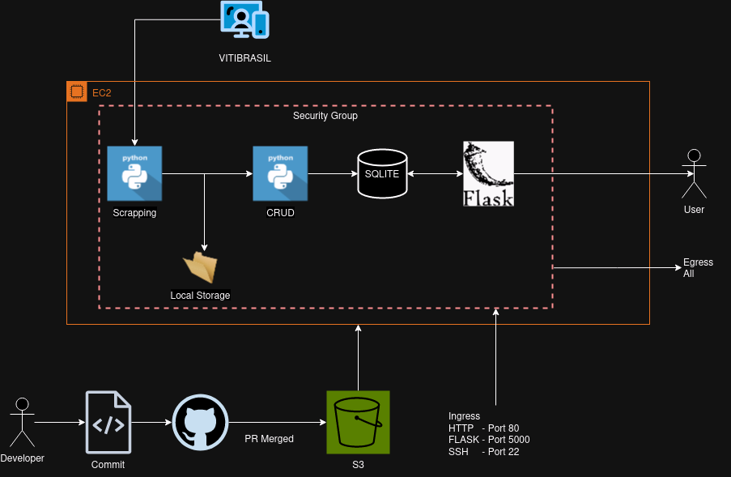
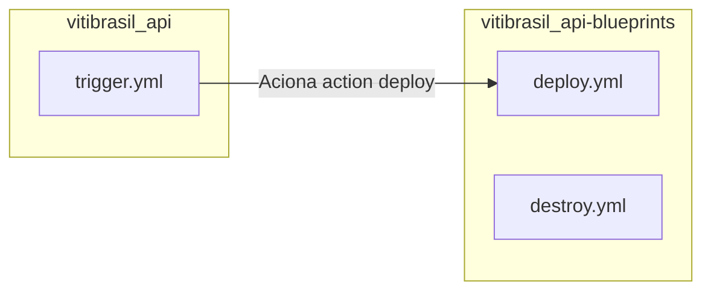

# vitibrasil_api
Projeto desenvolvido para o Tech Challenge da FIAP, cujo objetivo é criar uma API pública para consulta dos dados de vitivinicultura disponibilizados no site da Embrapa.

## Requisitos

- **Python 3.8**: A versão 3.8 do Python é necessária, pois é a versão suportada na EC2 da AWS.

## Instalação Local

Para configurar e executar a aplicação localmente, siga os passos abaixo:

### 1. Instalação do `make`

Instale o utilitário `make`, necessário para gerenciar o processo de instalação e execução da aplicação, utilizando o seguinte comando:

```bash
sudo apt-get install make -y
```

### 2. Instalação e Execução do Projeto

Após a instalação do `make`, execute os comandos abaixo para instalar as dependências e rodar a aplicação:

```bash
make install
make run-prod
```

### Detalhes dos Comandos

- **`make install`**: 
  - Cria um ambiente virtual Python.
  - Instala todas as dependências listadas no arquivo `requirements.txt`.

- **`make run-prod`**: 
  - Ativa o ambiente virtual.
  - Cria uma pasta temporária `tmp` para armazenar arquivos CSV do site vitibrasil.
  - Inicializa um banco de dados SQLite.
  - Executa scripts CRUD para criar as tabelas necessárias para cada endpoint.
  - Inicia o servidor da aplicação.

## Uso do Docker

Para executar o projeto utilizando Docker, siga os passos descritos abaixo:

### 1. Construção da Imagem Docker

Construa a imagem Docker a partir do Dockerfile incluso no projeto:

```bash
docker build -t vitibrasil_api .
```

### 2. Execução do Container Docker

Há duas opções para executar o container:

- **Visualizar Logs da API**:

    Execute o container no modo interativo para visualizar os logs da aplicação:
    ```bash
    docker run -it --network="host" vitibrasil_api
    ```
    Para sair, pressione `Ctrl + C`.

- **Executar em Segundo Plano**:

    Execute o container em segundo plano, mapeando a porta 5000 para acessar a API:
    ```bash
    docker run -d -p 5000:5000 vitibrasil_api
    ```

### Notas Importantes

- Certifique-se de que a porta 5000 está disponível e não está sendo utilizada por outro serviço.
- O projeto utiliza um banco de dados SQLite, que será iniciado e populado com dados extraídos dos arquivos CSV do site vitibrasil.

## Arquitetura



### Push e Execução da Esteira:
Cada push no repositório aciona a esteira de CI/CD, que será detalhada no próximo tópico.

### Deploy e Armazenamento:
O código do repositório é zipado e enviado para um bucket S3.

### Configuração da EC2:
A arquitetura da EC2 é configurada, incluindo os grupos de segurança necessários.

### Sincronização e Instalação:
- Quando a EC2 inicia, ela sincroniza com o arquivo no S3.
- O processo de instalação da API Flask é realizado na EC2.
- A API é iniciada, começando com a execução do scrapping para baixar os arquivos CSV.
- Em seguida, são executados os CRUDs para criar as tabelas e preencher os dados no SQLite.
- Todos os endpoints são documentados no Swagger.

### Atualização de EC2 Existente:
- Se já existir uma instância EC2 rodando, ela não será destruída e recriada.
- O arquivo zip do repositório será sobrescrito.
- Um comando CLI será executado para reiniciar a EC2.
- O script de boot será executado novamente, apagando os arquivos atuais.
- A sincronização com o S3 será refeita com o novo código em produção, seguido pelo processo de instalação.

## Push e Execução da Esteira
Cada push no repositório aciona a esteira de CI/CD, que será detalhada no próximo tópico.

## Deploy e Armazenamento
O código do repositório é zipado e enviado para um bucket S3.

## Configuração da EC2
A arquitetura da EC2 é configurada, incluindo os grupos de segurança necessários.

## Sincronização e Instalação
- Quando a EC2 inicia, ela sincroniza com o arquivo no S3.
- O processo de instalação da API Flask é realizado na EC2.
- A API é iniciada, começando com a execução do scrapping para baixar os arquivos CSV.
- Em seguida, são executados os CRUDs para criar as tabelas e preencher os dados no SQLite.
- Todos os endpoints são documentados no Swagger.

## Atualização de EC2 Existente
- Se já existir uma instância EC2 rodando, ela não será destruída e recriada.
- O arquivo zip do repositório será sobrescrito.
- Um comando CLI será executado para reiniciar a EC2.
- O script de boot será executado novamente, apagando os arquivos atuais.
- A sincronização com o S3 será refeita com o novo código em produção, seguido pelo processo de instalação.


## Pipeline de Deploy

Utilizamos GitHub Actions e Terraform para gerenciar o pipeline de deploy do projeto na AWS.

### Descrição do Fluxo de Deploy

Sempre que um Pull Request (PR) for mesclado na branch `main`, a action de deploy será acionada. O fluxo é o seguinte:



#### trigger.yml

Este arquivo verifica continuamente por novos commits na branch `main`. Quando detecta um push, dispara um evento `trigger-workflow` para o repositório `vitibrasil_api-blueprints`.

#### deploy.yml

Este arquivo realiza as seguintes etapas:

1. **Clone do Repositório**: Clona o repositório contendo o projeto.
2. **Inicialização do Terraform**: Executa o comando `terraform init`.
3. **Plano do Terraform**: Gera um plano de execução com `terraform plan`.
4. **Aplicação do Terraform**: Aplica as mudanças de infraestrutura com `terraform apply`.

#### destroy.yml

Este arquivo contém um script manual para limpar recursos não utilizados na AWS, economizando custos, executando `terraform destroy`.

### Detalhes do Terraform

O código Terraform realiza as seguintes ações:

- Compacta os arquivos do projeto.
- Envia os arquivos compactados para um bucket S3.
- Cria uma instância EC2 e configura o ambiente para executar a aplicação.

## Licença

Este projeto está licenciado sob os termos da licença MIT. Veja o arquivo [LICENSE](LICENSE) para mais detalhes.

---

Com esta documentação, esperamos que você tenha todas as informações necessárias para instalar, executar e contribuir para o projeto vitibrasil_api. Se precisar de ajuda, sinta-se à vontade para abrir uma issue no repositório.